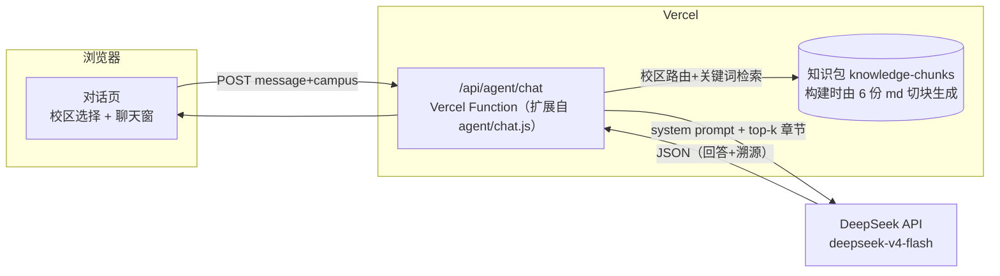

# 东南大学校区指南 Agent — 产品需求文档（PRD）

| 项目 | 内容 |
| --- | --- |
| 产品名称 | 东南大学校区指南 Agent（暂定名，可由社团另定对外名称） |
| 文档版本 | v1.0 |
| 文档日期 | 2026-08 |
| 出品方 | 东南大学地理协会（宣传账号体系 @东奔南走） |
| 文档状态 | 待评审 |
| 关联仓库 | SEUGA-VibeCoding / `SEUCampusGuidance/` |

> 本文档同时承担两个角色：一是社团内部开发协作的需求基准（功能清单、数据规范、API 契约、分工界面）；二是对外沟通材料（面向指导老师、学校相关部门或平台入驻审核时的产品说明，重点见第 2、3、12 章）。

---

## 目录

1. [背景与问题](#1-背景与问题)
2. [产品定位与目标](#2-产品定位与目标)
3. [用户与典型场景](#3-用户与典型场景)
4. [知识方案决策：RAG 知识库 vs 后端直接调取](#4-知识方案决策rag-知识库-vs-后端直接调取)
5. [功能需求](#5-功能需求)
6. [回答规范（内容非功能需求）](#6-回答规范内容非功能需求)
7. [系统架构与 API 契约](#7-系统架构与-api-契约)
8. [数据规范与知识接入流程](#8-数据规范与知识接入流程)
9. [里程碑路线图（整体路径）](#9-里程碑路线图整体路径)
10. [团队分工与协作接口](#10-团队分工与协作接口)
11. [合规、版权与风险](#11-合规版权与风险)
12. [成功指标](#12-成功指标)
13. [附录 A：知识源清单](#13-附录-a知识源清单)
14. [附录 B：术语表](#14-附录-b术语表)

---

## 1. 背景与问题

### 1.1 社团已有资产

东南大学地理协会自 2023 年起持续制作《东南大学新生实用信息简明指南》系列，以图片长图形式在 @东奔南走 各平台发布，覆盖九龙湖、四牌楼、丁家桥、苏州、江北、无锡六个校区，内容涵盖校园空间结构、宿舍、食堂、图书馆、行政办事、体育场馆、交通接驳、周边商业等新生最高频的信息需求。指南以 CC BY-SA 4.0 许可发布，累计源图 53 张。

在此基础上，社团已完成三类数字化资产：

1. **六校区结构化 md 文档**（`原校区指南-md文档整理/`，共约 16.3 万字）：由 2025 版指南图片逐张人工整理而成，统一包含元数据头、按主题分层的章节、`[源图 Pxx]` 页码溯源、内页信息差异记录，以及专为 Agent 场景撰写的「使用建议」与回答模板。
2. **四牌楼校园地图原型**（`web/`）：静态网页 + 腾讯地图，含 22 个人工标注点位与 119 条 Excel 导出记录。
3. **Agent 服务原型**（`agent/`）：Node 独立服务，已实现「本地关键词检索 → 上下文注入 → DeepSeek 生成」的完整链路，可部署为 Vercel Function。

### 1.2 图片版指南的局限

| 局限 | 表现 |
| --- | --- |
| 不可检索 | 新生只想知道「快递寄到哪」，却要在十几张长图里逐张翻找 |
| 跨校区分散 | 六个校区六套图，跨校区问题（如「丁家桥怎么去九龙湖」）需自行拼接 |
| 阅读门槛 | 长图信息密度极高，颜色/下划线等视觉编码（如接驳车大小交路）不易读懂 |
| 更新成本高 | 任何一处信息变动都要重新排版整张图 |
| 无法交互 | 不能按「我住梅园、明天是节假日」这类个人条件给出针对性答案 |

### 1.3 机会

2026 级新生将于 8 月底—9 月初报到。将已整理的结构化知识接入大模型问答，能把「翻图找信息」变为「一句话提问」，是社团知识资产价值的自然延伸，也是迎新季最有传播力的产品形态。

---

## 2. 产品定位与目标

### 2.1 一句话定位

> 面向东南大学新生与在校师生的校园生活知识问答 Agent：以地理协会六校区指南为知识底座，用对话方式快速、可溯源地回答校园生活问题。

### 2.2 目标用户

| 用户群 | 需求特征 |
| --- | --- |
| 2026 级本科/研究生新生（核心） | 报到前后集中爆发的高频问题：宿舍条件、床品尺寸、快递地址、食堂时间、怎么去校区 |
| 在校师生 | 低频但长尾：跨校区通勤、场馆预约规则、办事窗口位置 |
| 跨校区流动学生 | 研究生更换培养校区（如进入苏州、无锡校区），需要整套新校区生活信息 |
| 新生家长 | 送新期间的交通、住宿、周边信息 |

### 2.3 核心价值

1. **快**：一问一答，替代翻长图。
2. **全**：六校区统一入口，覆盖跨校区问题。
3. **可信**：每条回答标注知识版本与源图页码，明确区分「指南记录」与「需实时确认」。
4. **可持续**：知识以 md 文档维护，社团每年更新指南时同步更新知识库。

### 2.4 非目标（边界声明）

以下明确不做，需写入产品页脚/关于页并体现在回答话术中：

- **不是学校官方服务**：本产品为学生社团作品，不代表东南大学官方；官方通知、教务规定以学校发布为准。
- **不做实时信息承诺**（demo 阶段）：营业时间、班次、电话等一律标注知识版本并提示复核；实时能力在三期以工具接入方式引入。
- **不做办事代办**：不代查成绩、不代办业务、不涉及任何需要登录学校系统的操作。
- **不提供医疗建议**：涉及就医仅指引位置与急救渠道。
- **不采集个人信息**：无账号体系，不要求任何身份信息。

---

## 3. 用户与典型场景

以下场景全部可由现有知识库支撑（举例内容均出自 2025 版指南 md）。

### 场景 1：新生行前准备（九龙湖）

> 「我被分到梅园宿舍，床帘要买多大的？」

Agent 应答要点：2025.09 版指南记录校内本科宿舍床铺约 1.95 m × 0.85 m [源图 P06]；提示购买前向同楼栋学生或宿管复核；若用户住兰台研究生公寓则条件不同，需先确认。

### 场景 2：日常生活查询（四牌楼）

> 「沙塘园的快递寄到哪？」

Agent 应答要点：按 2025.08 版指南，沙塘园/成园快递由沙塘园近邻宝收寄，地址填对应住宿区 [源图 P02、P05]；提醒以取件码短信为准。

### 场景 3：跨校区通勤（丁家桥 → 九龙湖）

> 「明晚从丁家桥去九龙湖，最晚几点出发？」

Agent 应答要点：给出 25 版指南的两条路线（玄武门 1 号线→南京南换 3 号线；青春广场 5 号线→九龙湖南），约 1 小时、6 元；引用指南标注的晚间最迟乘车提醒（玄武门不晚于 23:30 等）[源图 P05]；强调末班车信息必须当天以南京地铁官方渠道复核。

### 场景 4：条件化查询（九龙湖接驳车）

> 「现在橘园有车去无线谷吗？」

Agent 应答要点：先确认工作日/节假日；给出 2025.09 版无线谷线对应时段班次 [源图 P12]；说明大小交路差异与「静态表≠实时」，引导使用「东南大学研究生」公众号查校车实时位置。

### 场景 5：安全兜底（任意校区）

> 「我同学在操场晕倒了怎么办？」

Agent 应答要点：立即建议拨打 120 并联系校园保卫/现场工作人员（此为最高优先级，先于任何位置信息）；再补充最近医疗点与 AED 参考位置。

---

## 4. 知识方案决策：RAG 知识库 vs 后端直接调取

这是本 PRD 要回答的核心技术问题。结论：**分阶段——demo 阶段不建向量 RAG，采用「校区路由 + 章节切块 + 关键词检索 + 上下文注入」；向量 RAG 与实时工具作为二、三期演进方向。**

### 4.1 体量事实

| 校区 | 字数 | 估算 token（约 0.6–0.7 token/字） |
| --- | ---: | ---: |
| 九龙湖 | 40,662 | ~2.4–2.8 万 |
| 无锡 | 28,660 | ~1.7–2.0 万 |
| 四牌楼 | 28,612 | ~1.7–2.0 万 |
| 丁家桥 | 24,248 | ~1.5–1.7 万 |
| 苏州 | 23,516 | ~1.4–1.6 万 |
| 江北 | 17,120 | ~1.0–1.2 万 |
| **合计** | **162,818** | **~10–11 万** |

关键推论：

- **单校区全文可直接放入上下文**（DeepSeek V4 Flash 上下文窗口远大于 2.8 万 token），意味着即使检索完全失效，「兜底注入整个校区」也可行。
- **六校区全量不宜每次都塞**：约 10 万 token/请求，成本、延迟、以及长上下文下的信息淹没都不划算。
- 因此问题的实质不是「要不要向量库」，而是「**如何把范围先缩小到单校区，再缩小到相关章节**」——这用确定性路由 + 关键词检索即可解决，不需要 embedding。

### 4.2 Demo 方案（一期）：结构化检索，零外部依赖

```
用户提问
  │
  ▼
① 校区路由 —— 前端校区选择器（默认必选）；对话中提及其他校区时由模型/关键词识别切换
  │
  ▼
② 章节检索 —— 在该校区的章节块内做关键词打分（复用 agent/chat.js 现有
   中文 n-gram 分词 + 子串打分函数），取 top-k 章节（目标 3–8k token）
  │
  ▼
③ 兜底策略 —— 命中分数过低时，注入该校区全文（≤2.8 万 token）
  │
  ▼
④ 生成 —— system prompt（第 6 章回答规范）+ 检索块（含 campus/section/源图页码元数据）
   → DeepSeek V4 Flash → 结构化 JSON（含 sources 溯源）
```

选择此方案的理由：

1. **知识本身已高度结构化**。六份 md 统一按主题分章、自带 `[源图 Pxx]` 溯源和推荐分块 key（如 `canteens_and_medical`、`shuttle_lantai_line`），相当于人工完成了 RAG 中最难的 chunking 与元数据标注环节。
2. **校园问答的查询词高度具名**。「梅园」「近邻宝」「兰台线」「莘园食堂」这类专名与文档词面高度重合，关键词检索召回率天然高；语义改写需求（向量检索的主要优势场景）占比低。
3. **零外部依赖**。无 embedding 服务、无向量数据库，知识随代码构建打包，Vercel 免费层即可运行，符合「一周内可用」目标。
4. **可解释可调试**。检索结果是明文章节，回答出错时能直接定位是「没检到」还是「检到了但答错」，对学生团队维护友好。
5. **已有可复用代码**。`agent/chat.js` / `agent/server.mjs` 的分词、打分、DeepSeek 调用、JSON 解析链路全部可复用，改造点集中在数据源替换与路由逻辑。

### 4.3 二期：升级向量 RAG 的触发条件与方案方向

满足以下任一条件时启动向量化改造：

| 触发条件 | 判断依据 |
| --- | --- |
| 知识规模显著增长 | 总量超过约 50 万字（如接入协会其他资料、历年沉淀、社群 QA 精选） |
| 多模态语料接入 | 原图、地图截图等图片需要参与检索（图文向量） |
| 召回率瓶颈 | 口语化/同义改写提问（「哪里能剪头发」→「理发」）的抽检未命中率持续偏高 |

方案方向（届时另立技术方案文档）：中文 embedding 模型（如 bge-m3 或 API 型 embedding）+ 轻量向量存储（Vercel Postgres pgvector / Cloudflare Vectorize / SQLite-vec 均可）+ 关键词与向量混合检索 + rerank。检索层在一期代码中即以独立函数隔离（见 7.3），保证可替换。

### 4.4 三期：实时信息与 MCP

静态知识（指南）与实时信息（校车位置、食堂营业状态、场馆余量）在架构上分离：前者走检索，后者走工具调用（function calling / MCP 工具）。模型按问题类型决定是否调用工具，回答时明确区分「指南记录」与「实时查询结果」。前提是拿到可用的数据源（学校接口、公众号页面等），详见 9.4。

---

## 5. 功能需求

优先级定义：P0 = demo（M0）必须有；P1 = 迎新季（M1）前补齐；P2 = 后续版本。

### 5.1 P0 — Demo 必须

| 编号 | 功能 | 需求描述 | 验收标准 |
| --- | --- | --- | --- |
| F-01 | 校区选择与识别 | 页面提供六校区选择器（必选，默认九龙湖）；用户提问明显指向其他校区时，Agent 应答中提示或自动切换 | 六校区均可提问并得到对应校区知识的回答 |
| F-02 | 知识问答 | 输入自然语言问题，返回基于知识库的中文回答 | 附录 A 的抽检问题集可用率达标（见第 12 章） |
| F-03 | 来源标注 | 每条回答标注知识版本（如「2025.09 版指南」）；响应携带 `sources` 字段（校区/章节/源图页码） | 回答正文含版本口径；API 响应含结构化溯源 |
| F-04 | 时效性免责 | 涉及营业时间、班次、电话、费用等易变信息时，回答附「可能调整，建议复核」提示 | 抽检易变信息类问题 100% 带提示 |
| F-05 | 紧急问题安全兜底 | 识别急病、受伤、火灾、治安类问题，优先给出 120/119/110、保卫处、校医院指引，再给位置参考 | 紧急类测试问题 100% 安全指引前置 |
| F-06 | 未命中兜底 | 知识库无法支撑的问题，明确回答「指南未覆盖」，不编造，并引导官方渠道（学校官网、公众号等） | 库外问题（如「期末考试安排」）不产生编造答案 |
| F-07 | 服务未配置提示 | DEEPSEEK_API_KEY 未配置时返回 503，前端展示友好提示（沿用现有行为） | 本地无 Key 启动可复现 |
| F-08 | 基础频控 | 单 IP 简单限流与输入长度上限，防滥用刷 API 成本 | 超限返回 429 |

### 5.2 P1 — 迎新季前

| 编号 | 功能 | 需求描述 |
| --- | --- | --- |
| F-11 | 推荐问题引导 | 按所选校区展示 6–8 个高频问题快捷入口（床品尺寸、快递、食堂时间、怎么到校…） |
| F-12 | 多轮对话 | 携带近几轮对话历史，支持「那橘园呢？」式追问（API 已预留 `history` 字段） |
| F-13 | 答案反馈 | 每条回答提供「有用 / 有误」反馈按钮，落库或落表供人工核查 |
| F-14 | 原图溯源跳转 | 回答的 `sources` 可点击跳转到对应校区原指南图片（画廊已有基础） |
| F-15 | 关于页 | 产品定位、非官方声明、许可与署名（CC BY-SA 4.0、作者名单）、反馈渠道 |

### 5.3 P2 — 后续版本

| 编号 | 功能 | 需求描述 |
| --- | --- | --- |
| F-21 | 地图联动恢复 | 补全其余五校区地图点位后，恢复回答 → 地图高亮联动（`placeIds` 字段已预留） |
| F-22 | 微信小程序接入 | 小程序端复用同一 `/api/agent/chat` 契约（见第 7 章） |
| F-23 | 向量检索升级 | 按 4.3 触发条件实施 |
| F-24 | 实时信息工具 | 按 4.4 接入（校车实时等） |
| F-25 | 26 版知识更新 | 2026 版指南发布后按第 8 章流程换版 |

---

## 6. 回答规范（内容非功能需求）

规则 1–9 提炼自六份 md 的「Agent 使用建议」章节，规则 10 为产品层补充约定。本章是 system prompt 的编写基准，**实现时逐条落入 system prompt，并在测试集中逐条设验证用例。**

1. **只依据注入的知识回答**，不得编造地点、时间、电话、班次或实时状态；知识不足时明确说明。
2. **版本口径**：引用知识一律采用「2025.09 版指南显示……」句式（版本号取自对应校区 md 的 `source_version`），不得表述为当前实时状态。
3. **先确认关键前提**：涉及位置/耗时/快递/食堂的问题，若用户未说明出发区域（宿舍区、校门、楼栋），先追问再回答（如九龙湖需区分桃园/梅园/橘园/兰园/兰台/苏源）。
4. **区分校内宿舍与校外公寓**：兰台研究生公寓等校外住宿的卫浴、热水、门禁、接驳条件与校内不同，不得合并回答。
5. **差异项并列呈现**：原指南内页存在矛盾的信息（如四牌楼食堂早餐 06:30/06:40、苏州「林泉街/文泉街」、江北菜鸟驿站两种位置），必须并列告知并建议现场复核，不得擅自择一。
6. **易变信息附复核提示**：营业时间、班次、电话、收费、门禁、商户、App 入口均属易变信息；商户名称仅作历史参考，不得回答「现在一定营业」。
7. **接驳车/公交先问条件**：先确认线路、工作日/节假日；涉及「下一班」「车到哪了」一律引导实时查询渠道，静态时刻表仅作参考。
8. **紧急问题安全优先**：急病、受伤、火灾、治安类问题，第一句先给 120/119/110、保卫处、校医院或现场求助指引，之后才是位置参考。
9. **保留来源页码**：回答依据的章节需在 `sources` 中携带 `[源图 Pxx]` 页码，支持人工回查原图。
10. **语言与语气**：默认简体中文，友好简洁；面向新生避免校内黑话缩写（首次出现给全称）。

---

## 7. 系统架构与 API 契约

### 7.1 Demo 部署架构（M0）



要点：

- **知识随代码打包**：构建脚本把六份 md 切块为一个 JS/JSON 数据文件（约 600 KB，远低于函数体积限制），无需数据库，冷启动直接可用。构建脚本模式可参考现有 `web/scripts/build_artifacts.mjs`。
- **Key 只在服务端**：`DEEPSEEK_API_KEY` 为 Vercel 环境变量，永不下发前端（沿用现有设计）。
- **现有本地开发链路保留**：`agent/server.mjs`（本地 5174 端口）与 Vercel Function 共享同一套检索/生成核心模块，本地无 Key 时降级提示。
- 对话页可作为 `web/` 内新页面或独立轻量页面实现，不依赖腾讯地图 Key。

### 7.2 API 契约（v1.1，向后兼容现有实现）

小程序组同学以本节为对接基准；本契约冻结后如需变更须在群内周知并更新本文档。

**`POST /api/agent/chat`**

请求体：

```jsonc
{
  "message": "梅园到教学楼要多久",       // 必填，用户问题，≤500 字
  "campus": "jiulonghu",                // 可选，校区 slug；缺省时服务端识别，识别不出则在回答中追问
  "history": [                          // 可选（P1 生效），近几轮对话，最多 6 条
    { "role": "user", "content": "..." },
    { "role": "assistant", "content": "..." }
  ]
}
```

校区 slug 枚举：`jiulonghu` 九龙湖｜`sipailou` 四牌楼｜`dingjiaqiao` 丁家桥｜`suzhou` 苏州｜`jiangbei` 江北｜`wuxi` 无锡。

成功响应（200）：

```jsonc
{
  "message": "2025.09 版指南显示，从梅园食堂西门到教学楼东口步行约 10 分钟……时间可能调整，建议预留余量。",
  "campus": "jiulonghu",                // 本次回答实际采用的校区
  "sources": [
    {
      "campus": "jiulonghu",
      "section": "2.3 从宿舍区前往常用教学地点的耗时参考",
      "pages": ["P03"],
      "version": "2025.09"
    }
  ],
  "placeIds": []                        // 保留字段：地图点位 ID，P2 地图联动恢复后使用
}
```

错误响应：`400` message 缺失或超长；`429` 触发频控；`503` `{ "error": "DEEPSEEK_API_KEY is not configured" }`；`500` 服务内部错误。

兼容性说明：现有响应字段 `message`/`placeIds` 保持不变，新增 `campus`/`sources` 为增量字段，不影响现有 web 端。

### 7.3 面向演进的代码结构约定

- **检索层独立**：`retrieve(campusId, query) → chunks[]` 作为独立模块函数，一期为关键词实现，二期可替换为向量/混合检索而不动生成层。
- **知识层独立**：切块数据带统一 schema（见 8.2），检索实现不感知 md 原文格式。
- **生成层独立**：system prompt 单独成文件维护（对应第 6 章规则），便于非开发同学参与调话术。

---

## 8. 数据规范与知识接入流程

### 8.1 知识源文档规范（沿用现有 md 约定）

每份校区知识 md 必须包含：

1. **YAML frontmatter**：`title` / `campus` / `source_version` / `license` / `source_author` / `transcription_status`；
2. **章节结构**：`##` 一级主题、`###` 二级细分，标题语义明确；
3. **溯源标注**：事实句尾以 `[源图 Pxx]` 标注来源页；
4. **差异项章节**：集中记录内页矛盾、疑似笔误与不确定信息；
5. **Agent 使用建议章节**：该校区特有的回答规则与分块建议。

新校区/新文档入库前按此清单自检；六份现有 md 已全部满足。

### 8.2 切块规则与元数据 schema

构建脚本按以下规则从 md 生成知识块：

- 以 `##` 一级章节为基本块；超长章节（>3,000 字，如九龙湖接驳车）按 `###` 再切；
- frontmatter 与「目录」「版权署名」章节不进入检索块（版权信息由关于页承载）；
- 每块生成：

```jsonc
{
  "id": "jiulonghu/09-shuttle/9.4",       // campus/章节序号/小节
  "campus": "jiulonghu",
  "campusName": "九龙湖校区",
  "version": "2025.09",                    // 取自 frontmatter source_version
  "sectionPath": "9 校内接驳交通 > 9.4 兰台线（兰台发车）",
  "chunkKey": "shuttle_lantai_line",       // 沿用 md 内「建议的知识分块」key，无对应者留空
  "pages": ["P13"],                        // 从块内 [源图 Pxx] 聚合
  "text": "……"                             // 章节正文（保留表格）
}
```

### 8.3 知识更新流程（含 26 版换版）

```
原始材料（新版指南图片 / 其他资料）
  → 人工整理为 md（按 8.1 规范；图片可先 OCR 辅助、必逐条人工校对）
  → 记录差异项与不确定信息（宁缺勿错）
  → 第二人审核（对照原图抽查）
  → 合并入仓库 → 构建脚本重新切块 → 部署
```

- **版本共存原则**：26 版指南发布后逐校区替换，`source_version` 随之更新，回答口径自动变为「2026.xx 版指南显示…」；未更新校区继续使用 25 版并如实标注。
- **图片类知识**（P2）：原图已在 `原校区指南/` 与画廊组件中，短期以「回答附原图链接」方式接入；图片内容参与检索属二期向量化范畴。
- **社群 QA 沉淀**（远期）：迎新群高频问答经核实后可整理为补充 md（同一规范），成为指南外的第二知识源。

---

## 9. 里程碑路线图（整体路径）

> 时间基准：2026-08-05。新生报到季约为 8 月底—9 月初。

### M0（8/5–8/12，一周）：Vercel Demo 上线 ✦ 当前阶段

| 事项 | 产出 |
| --- | --- |
| 知识构建脚本：6 份 md → 切块数据 | `data/knowledge-chunks`（含 8.2 schema） |
| Agent 改造：校区路由 + 章节检索 + 新 system prompt + `sources` 溯源 | 扩展后的 `agent/chat.js` / `server.mjs` |
| 对话页：校区选择器 + 聊天窗 + 免责页脚 | 可公开访问的网页 |
| 部署与冒烟：Vercel 上线、六校区抽检问题集跑通 | demo URL + 测试记录 |

验收口径见第 12 章 M0 部分。

### M1（8/13–8/31，迎新季冲刺）：内测 → 公开

- 社团内测（协会成员 + 少量 26 级新生），收集 badcase 修 prompt 与检索；
- P1 功能：推荐问题、多轮对话、反馈按钮、关于页、原图跳转；
- 运营配合：@东奔南走 迎新推送携带入口；迎新群置顶。

### M2（9–10 月）：小程序接入与检索升级评估

- 小程序组按第 7.2 契约接入（后端零改动或仅加鉴权/域名配置）；
- 以 M1 反馈数据评估 4.3 触发条件，决定是否启动向量 RAG；
- 地图点位众包补全启动（五校区），为 F-21 地图联动做数据准备。

### M3（11 月起，远期）：实时化与多模态

- 调研并接入实时数据源（校车实时页、食堂状态等），以工具调用/MCP 形式接入；
- 图片多模态检索（原图直接可查）；
- 形成「每年新版指南 → 知识库换版」的常态化机制（8.3 流程固化为社团交接文档）。

### 依赖与前置条件

| 里程碑 | 外部依赖 |
| --- | --- |
| M0 | DeepSeek API Key（已有）；Vercel 账号 |
| M1 | 迎新宣发排期（社团运营） |
| M2 | 小程序主体资质与类目审核（小程序组）；备案域名（如需 request 合法域名） |
| M3 | 学校/第三方实时数据源可用性（不可控，需调研） |

---

## 10. 团队分工与协作接口

| 角色 | 职责 | 关键交付物 | 人员 |
| --- | --- | --- | --- |
| 产品/统筹 | PRD 维护、里程碑推进、对外沟通 | 本文档、周知记录 | 待定 |
| 知识与内容 | md 维护、差异核验、26 版换版、badcase 修正 | `原校区指南-md文档整理/`、抽检记录 | 待定 |
| Agent 后端 | 检索、prompt、API、部署 | `agent/`、知识构建脚本 | 待定 |
| Web 前端 | 对话页、推荐问题、反馈组件 | `web/` 对话页面 | 待定 |
| 小程序 | 小程序端全栈（独立分工） | 小程序，按 7.2 契约对接 | 另组同学 |
| 运营 | 迎新宣发、反馈收集、答案抽检 | 推送、反馈汇总表 | 待定 |

协作接口约定：

1. **API 契约（7.2）是后端与小程序组的唯一对接基准**，变更需双方确认并更新本文档；
2. **回答话术问题走内容组**：非开发成员通过修改 system prompt 文件与知识 md 参与迭代，不需要动检索/生成代码；
3. **知识修改必须走 8.3 流程**（含第二人审核），不接受直接改线上数据。

---

## 11. 合规、版权与风险

### 11.1 版权与许可

- 原指南以 **CC BY-SA 4.0** 发布，版权方为东南大学地理协会（@东奔南走）。本产品作为衍生使用方，须：在关于页完整署名（含原指南各校区信息收集、审核、排版人员名单）、标注许可协议与知识版本、对知识内容的再分发保持相同许可。
- 苏州篇参考了东南大学苏州校区新媒体中心内容、无锡篇由无锡校区新媒体工作部/工作室参与制作，署名时一并保留。
- 产品名称与视觉避免使用东南大学校徽等官方标识，避免被误认为官方服务。

### 11.2 主要风险与对策

| 风险 | 影响 | 对策 |
| --- | --- | --- |
| 模型幻觉/答错 | 新生被误导（如跑错快递点、错过末班车） | 第 6 章规范强约束（只依据知识、来源标注、易变信息免责）；F-06 未命中兜底；F-13 反馈通道 + 人工抽检；关于页明示参考性质 |
| 知识过期 | 25 版信息与 26 年实际不符 | 回答强制带版本口径；高时效字段一律附复核提示；8.3 换版流程；迎新季前对高频条目（食堂、快递、接驳）做一轮人工复核 |
| 紧急场景误答 | 延误就医等严重后果 | F-05 安全兜底前置，测试集单列紧急类用例，上线前 100% 通过 |
| API 成本失控 | Key 被刷爆、社团经费受损 | Key 仅服务端；F-08 IP 频控 + 输入长度限制 + 上下文 token 上限；成本按「单次请求 ≈ 检索上下文 3–8k token + 输出 ≤1k token」结合 DeepSeek 官网现行单价估算，设置日用量告警阈值 |
| 提示词注入 | 用户诱导 Agent 输出越界内容 | system prompt 明确边界；知识外问题一律兜底话术；不接入任何执行类工具（demo 阶段） |
| 小程序审核 | 类目/AI 内容审核不通过延误 M2 | 小程序组提前确认类目与生成式 AI 相关平台要求；必要时接入平台内容安全接口；web 端不受影响，作为保底入口 |
| 隐私 | 无 | 不设账号、不采集个人信息；提问日志仅用于匿名化的质量抽检，关于页说明 |
| 单点依赖 | DeepSeek 服务波动 | OpenAI-compatible 接口，模型可替换；异常时前端明确降级提示（沿用 503 机制） |

---

## 12. 成功指标

### M0 验收（demo 可发布线）

- 六校区各准备 ≥10 条测试问题（覆盖：稳定事实、易变信息、差异项、跨校区、紧急类、库外问题），共 60+ 条；
- **答案可用率 ≥80%**（可用 = 事实与知识库一致 + 口径合规）；
- 紧急类与库外问题合规率 **100%**（安全前置、不编造）；
- 端到端 P95 响应 ≤15 s。

### M1 迎新季（定量）

| 指标 | 目标 |
| --- | --- |
| 迎新季累计提问量 | ≥1,000 次（结合宣发触达评估） |
| 反馈好评率（有用/总反馈） | ≥85% |
| badcase 修复时效 | 高频错误 48h 内修正 |

### M2+ 观察指标

- 小程序端/网页端提问量分布；口语化提问未命中率（决定是否向量化）；地图联动使用率。

---

## 13. 附录 A：知识源清单

| 文件 | 校区 | 版本 | 源图 | 字数 | 备注 |
| --- | --- | --- | ---: | ---: | --- |
| `东南大学九龙湖校区指南_2025版整理.md` | 九龙湖 | 2025.09 | 16 张 | 40,662 | 含三条接驳车完整时刻表、兰台公寓专章 |
| `东南大学四牌楼校区指南_2025版整理.md` | 四牌楼 | 2025.08 | 11 张 | 28,612 | 含 16 栋文昌宿舍逐栋房型、AED 点位 |
| `东南大学无锡校区指南_2025版整理.md` | 无锡 | 2025（25版） | 8 张 | 28,660 | 含无人小巴时刻、分校门地铁路线 |
| `东南大学丁家桥校区指南_25版整理.md` | 丁家桥 | 25版（无月份） | 6 张 | 24,248 | 含中大医院小门、跨校区路线 |
| `东南大学苏州校区指南_2025版整理.md` | 苏州 | 2025（25版） | 7 张 | 23,516 | 含水电费、慧湖通报修、苏州交通 |
| `东南大学江北校区指南_2025版整理.md` | 江北 | 2025（25版） | 5 张 | 17,120 | 含西/东区结构、机场巴士 |
| 合计 | 6 校区 | — | 53 张 | 162,818 | 均含差异项记录与 Agent 使用建议 |

辅助数据（demo 非必需，保留待用）：`data/map-features.js`（四牌楼 22 点位）、`data/guide-data.js`（四牌楼 119 条 Excel 记录）、`data/guide-pages.js`（原图与组件对应关系）、`原校区指南/`（四牌楼原图 10 张）。

## 14. 附录 B：术语表

| 术语 | 含义 |
| --- | --- |
| RAG | Retrieval-Augmented Generation，检索增强生成：先检索相关知识片段再交给模型作答 |
| 向量检索 / embedding | 将文本编码为向量、按语义相似度召回的检索方式；与关键词检索相对 |
| 切块（chunking） | 把长文档按语义单元切分为可独立检索的片段 |
| system prompt | 注入模型的系统级指令，本产品中承载第 6 章回答规范 |
| MCP | Model Context Protocol，模型接入外部工具/数据源的开放协议 |
| slug | 校区的英文标识符（如 `jiulonghu`），用于 API 参数 |
| 大小交路 | 公交/接驳车术语：同一线路的长短两种运行区间（九龙湖接驳车语境） |

---

*本文档随项目迭代更新；修订记录自 v1.1 起在此追加。*
